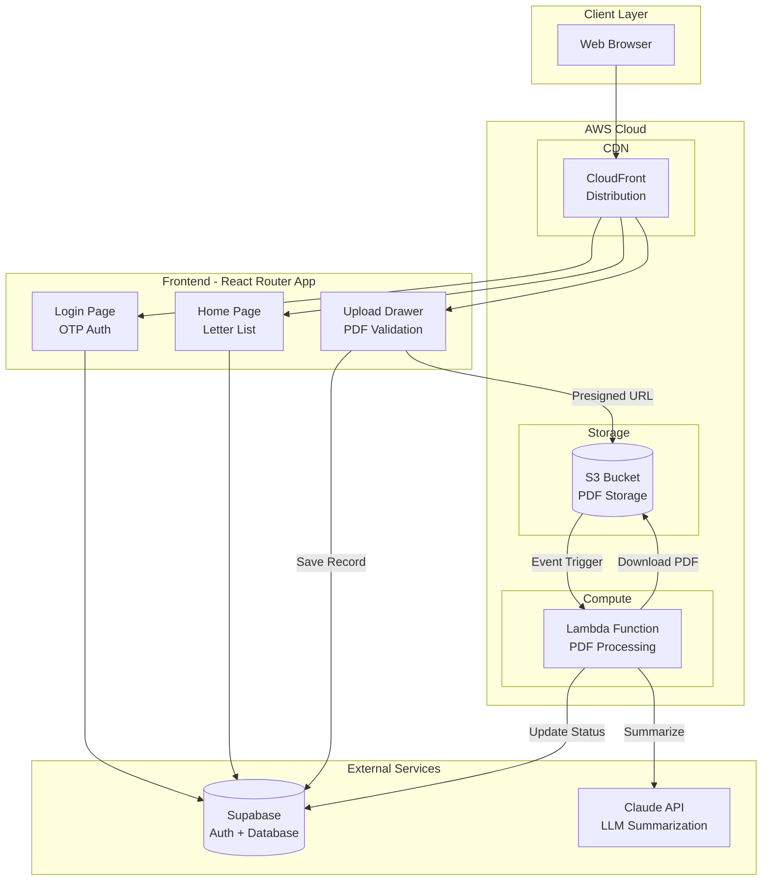

# Clinical Letters

A full-stack application for uploading, processing, and managing clinical letters. Automatically extracts patient information and generates AI-powered summaries using Claude.

## Architecture

```
┌─────────────────────────────────────────────────────────────────────┐
│                           User Browser                              │
└─────────────────────────────────────────────────────────────────────┘
                                   │
                                   ▼
┌─────────────────────────────────────────────────────────────────────┐
│                     React Router App (SST)                          │
│  ┌─────────────┐  ┌─────────────┐  ┌─────────────────────────────┐  │
│  │ Login (OTP) │  │ Letter List │  │ Upload Drawer               │  │
│  │             │  │ Table/Cards │  │ (PDF validation, S3 upload) │  │
│  └─────────────┘  └─────────────┘  └─────────────────────────────┘  │
└─────────────────────────────────────────────────────────────────────┘
         │                   │                        │
         ▼                   ▼                        ▼
┌─────────────────┐  ┌─────────────────┐     ┌───────────────┐
│    Supabase     │  │    Supabase     │     │   S3 Bucket   │
│   Auth (OTP)    │  │   (letters,     │     │   (uploads/)  │
│                 │  │    patients)    │     └───────────────┘
└─────────────────┘  └─────────────────┘              │
                                                      │ S3 Event Trigger
                                                      ▼
                                          ┌───────────────────────┐
                                          │   Lambda Function     │
                                          │  ┌─────────────────┐  │
                                          │  │ Extract PDF text│  │
                                          │  │ Find NHS number │  │
                                          │  │ Claude summary  │  │
                                          │  │ Update Supabase │  │
                                          │  └─────────────────┘  │
                                          └───────────────────────┘
```

### UML Component Diagram



## Tech Stack

- **Frontend**: React Router v7, TailwindCSS
- **Backend**: SST (Serverless Stack), AWS Lambda
- **Database**: Supabase (Postgres + Auth)
- **Storage**: AWS S3
- **AI**: Claude Sonnet 4 for letter summarization

## Prerequisites

- Node.js 20+
- pnpm
- AWS CLI configured with profiles:
  - `clinical-letters-dev` (development)
  - `clinical-letters-production` (production)
- Supabase project

## Environment Setup

### 1. SST Secrets

Set the following secrets using SST:

```bash
# Development
pnpm sst secret set SupabaseUrl <your-supabase-url>
pnpm sst secret set SupabasePublishableKey <your-anon-key>
pnpm sst secret set SupabaseServiceKey <your-service-role-key>
pnpm sst secret set ClaudeApiKey <your-anthropic-api-key>

# Production (add --stage production)
pnpm sst secret set SupabaseUrl <url> --stage production
```

### 2. Supabase Setup

Run migrations against your Supabase project:

```bash
supabase db push
```

Or apply migrations manually from `supabase/migrations/`.

## Development

```bash
# Install dependencies
pnpm install

# Start local dev server with SST
pnpm sst dev
```

The app will be available at the URL provided by SST (typically `http://localhost:5173`).

## Deployment

```bash
# Deploy to production
pnpm sst deploy --stage production
```

**Note:** As of October 2025, AWS requires both `lambda:InvokeFunctionUrl` AND `lambda:InvokeFunction` permissions for public Lambda URLs. SST may not add both automatically. If you get a 403 Forbidden error after deploying, run:

```bash
aws lambda add-permission \
  --function-name <your-function-name> \
  --statement-id AllowPublicInvoke \
  --action lambda:InvokeFunction \
  --principal "*" \
  --profile clinical-letters-production
```

## Project Structure

```
├── app/
│   ├── components/
│   │   ├── letter-table.tsx    # Responsive letter list (table/cards)
│   │   └── upload-drawer.tsx   # PDF upload side drawer
│   ├── routes/
│   │   ├── home.tsx            # Main page with letter list
│   │   ├── login.tsx           # OTP authentication
│   │   └── auth.callback.tsx   # OAuth callback handler
│   └── lib/
│       └── supabase/           # Supabase client utilities
├── packages/
│   └── functions/
│       └── src/
│           └── process.ts      # Lambda: PDF processing & summarization
├── supabase/
│   └── migrations/             # Database schema migrations
└── sst.config.ts               # SST infrastructure config
```

## Key Features

- **OTP Authentication**: Email magic link sign-in via Supabase
- **PDF Upload**: Client-side validation (PDF only, 10MB max), direct S3 upload
- **Automatic Processing**: S3 triggers Lambda on upload
- **NHS Number Extraction**: Regex pattern matching from PDF text
- **AI Summarization**: Claude generates 3-5 bullet point summaries
- **Status Updates**: Polling every 5 seconds for processing status
- **Responsive Design**: Mobile cards, desktop table layout
- **Infrastructure as Code**: All AWS resources defined in SST (sst.config.ts)

## Testing

```bash
pnpm vitest run
```

Tests cover NHS number extraction and input validation logic.

## CI/CD Considerations

Not fully implemented, but supports:
- `pnpm sst deploy --stage <env>` for deployments
- Secrets managed via `pnpm sst secret set`
- Separate AWS profiles for dev/production

---

## Technical Decisions

### 1. Security

**What's in place:**
- Magic link login (no passwords to steal)
- Database row-level security - users only see their own uploads
- Backend secrets stay on the server (Lambda), never sent to browser
- Upload URLs expire after 5 minutes
- File validation: only PDFs, max 10MB

**Current assumption:** All authenticated users are trusted healthcare staff with access to all patient data. No role-based access control beyond authentication.

**What I'd add for production:**
- Rate limiting to prevent spam uploads
- Audit logs to track who accessed what
- Stricter encryption for stored files
- Role-based access control (admin vs standard user)

### 2. Scalability

**Current setup works for:** ~100 concurrent users, moderate upload volume.

**If usage grew significantly:**
- **Message queue (SQS):** Put uploads in a queue so Lambda processes them at a steady pace, prevents overwhelming the system during spikes
- **Load balancer:** Distribute traffic across multiple servers if the frontend needed horizontal scaling
- **Caching:** Store patient lookups in memory (Redis) to reduce database hits
- **Database read replicas:** Spread read queries across copies of the database

### 3. Input Validation

| Layer | Validation |
|-------|-----------|
| Client (Zod) | File type (PDF only), file size (max 10MB) |
| S3 | Presigned URL restricts to `uploads/` prefix |
| Lambda | PDF parsing validates file is readable |
| Database | NHS number format checked before patient lookup |

### 4. Error Handling

| What can go wrong | What happens |
|-------------------|--------------|
| AI service down | Letter marked as ERROR, user can re-upload |
| Corrupted PDF | Extraction fails, letter marked ERROR |
| No NHS number found | Letter marked ERROR with message |
| Database down | Processing retries automatically (twice) |

**Not yet handled:** Automatic retry button for failed letters.

### 5. Observability

**How I'd debug issues:**
1. Check CloudWatch Logs for the Lambda function
2. Search by filename to trace the processing
3. Check letter status in database if stuck

**What I'd track in production:**
- How many letters processed per day
- Average processing time
- Error rate and types

### 6. Cost Breakdown

| Service | % of Cost | Notes |
|---------|-----------|-------|
| Claude AI | ~60% | ~$0.01 per letter summarized |
| Lambda | ~20% | Very cheap, pay per use |
| S3 Storage | ~15% | Pennies per GB |
| Supabase | ~5% | Free tier covers dev |

**To reduce costs:** Use Claude Haiku (cheaper model) for simple letters, archive old files.

### 7. Data Model

**Why Supabase/Postgres:**
- Built-in auth saves writing login code
- Row-level security is built in
- Familiar SQL, good tooling
- Managed service - no database maintenance

**AWS Alternative:** Since we're already on AWS, could use RDS (Postgres) or DynamoDB. Supabase was faster to set up for a demo, but RDS would keep everything in one ecosystem and simplify IAM permissions.

**Schema:**
- `patients` - stores NHS numbers (indexed for fast lookup)
- `letters` - stores upload metadata, status, AI summary
- Foreign key links letters to patients once NHS number extracted

**Current setup:** Single Supabase instance shared across environments. In production, you'd have separate local/staging/production databases to prevent direct changes to production data.

### 8. Why Async Processing

Upload triggers background Lambda vs waiting for API response.

| Async (what I built) | Sync (alternative) |
|---------------------|-------------------|
| User gets instant "uploaded" feedback | User waits 5-10 seconds |
| Can handle slow AI responses | Risk of timeout |
| Auto-retries on failure | Manual retry needed |

Async felt right because AI summarization can take a few seconds and I didn't want users staring at a spinner.

### 9. Polling vs WebSockets

**Current approach: Polling** - frontend checks for status updates every few seconds.

| Polling (what I built) | WebSockets (alternative) |
|------------------------|-------------------------|
| Simple to implement | Real-time instant updates |
| Works everywhere | More complex setup |
| Slight delay in updates | Lower latency |
| More HTTP requests | Persistent connection |

For this demo, polling was faster to build and works fine. For production with many users, WebSockets (or Supabase Realtime) would be more efficient - fewer requests, instant updates.

### 10. Known Limitations

- No retry button for failed letters (must re-upload)
- Polling for status (not real-time WebSocket)
- Only handles typed PDFs (no scanned document OCR)
- Single NHS number format (XXX XXX XXXX)

**Future improvements:** WebSocket status updates, retry mechanism, OCR for scanned docs.

### 11. Production Readiness

**Current state: Demo**

For production I'd need to:
- Tighten database policies (currently relaxed for easier testing)
- Add monitoring alerts for errors
- Set up backup procedures
- Security review
- Load testing with realistic volumes

---

## Assumptions

- **Shared patient access:** All users within a practice can view all patient letters. No per-user patient restrictions.
- **Patient must exist first:** Cannot upload a letter for a patient not already in the database. NHS number must match an existing patient record.
